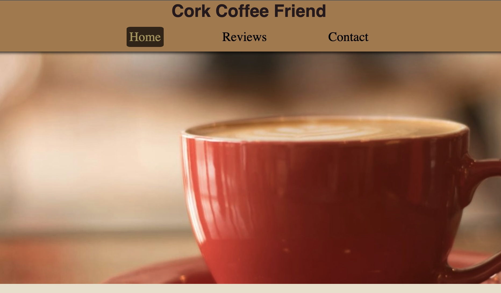

# Coffee-Site

Welcome to Cork Coffee Friend, your ultimate guide to exploring the vibrant café culture in Cork City! Whether you're a seasoned coffee connoisseur or someone looking for a cozy spot to enjoy a cup of joe, we've got you covered.

<h2 align="center"></h2>

## Table of Contents
- [Introduction](#introduction)
- [Features](#features)
- [Testing](#Testing)

## Introduction
Cork Coffee Friend is a curated platform that dives into the heart of Cork City's café scene. We specialize in reviews that capture the essence of each café, providing insights into the coffee quality, ambiance, and unique features that make each location special.

## Features

### Existing Features

* Four html pages with styles in one CSS file to create a uniform style
* Four real café reviews
* All links and buttons react to hover so it's clear that they are interactive
* Newsletter sign-up form with validation

* __Navigation Bar__
- All pages of the website has the navigation bar at the top that links to other parts of the site to allow for easy navigation to different parts of the website. The navigation bar highlights any of the links when they are hovered and they react when they are clicked. The same highlight color is used to show which page is currently open. In the screenshot below the Home page is open so the link for that is highlighted.

<h2 align="center"></h2>

* __Footer__
- All pages have the same footer, with links to social media in the form of their respective logos, like the navbar links the social media links also highlight when hovered over to help show that they are clickable, unlike the navbar the social media links open in a new window.

<h2 align="center"></h2>

- __The landing page__

## Testing

### W3C Validator Testing

All HTML has been tested with the W3C validator and show no errors or warnings.

All CSS has been testeed with W3C validator (Jigsaw) and show no errors or warnings.

### Accessibility
Lighthouse Testing actually showed lower performance for the reviews page where there are four somewhat large jpg files, these were converted to webp to improve performance.

see [TESTING.md](TESTING.md) for more details

### Solved Bugs

* Navbar links would shift to a different horizontal alignment from site logo for smaller devices causing a bad look. Issue was caused by size of navbar being set relative to width of screen/window. Resolution was to add a min-width attribute to navbar so elements would not overflow the navbar size. 

### Known Bugs
* Validation for the newsletter form does not check if the email field contains a valid email address

