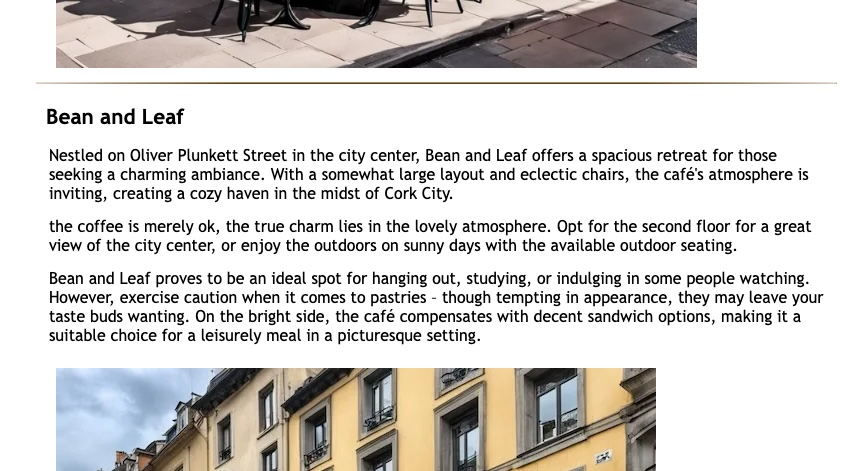
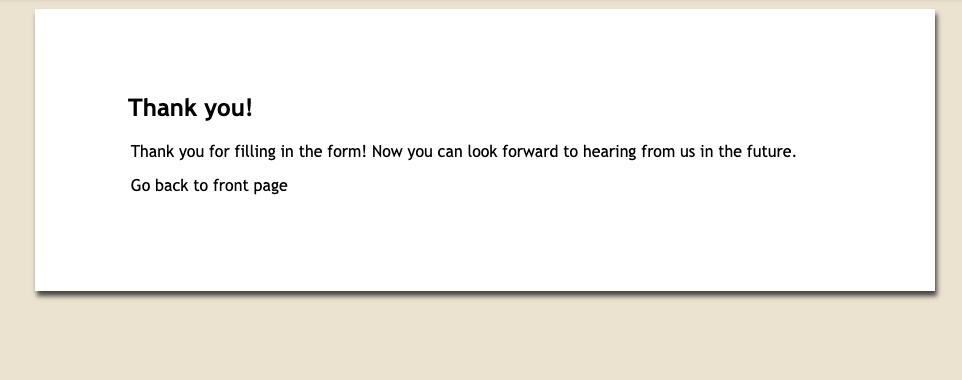

# Coffee-Site

Welcome to Cork Coffee Friend, your ultimate guide to exploring the vibrant café culture in Cork City! Whether you're a seasoned coffee connoisseur or someone looking for a cozy spot to enjoy a cup of joe, we've got you covered.

## Table of Contents
- [Coffee-Site](#coffee-site)
  * [Table of Contents](#table-of-contents)
  * [Introduction](#introduction)
  * [Design](#design)
    + [Colour Scheme](#colour-scheme)
    + [Typography](#typography)
    + [Accessibility](#accessibility)
  * [Features](#features)
    + [Existing Features](#existing-features)
  * [Testing](#testing)
    + [W3C Validator Testing](#w3c-validator-testing)
    + [Accessibility Test](#accessibility-test)
    + [Solved Bugs](#solved-bugs)
    + [Known Bugs](#known-bugs)
  * [Deployment](#deployment)
  * [Credits](#credits)
    + [Content](#content)
    + [Media](#media)
    + [Tools](#tools)
<small><i><a href='http://ecotrust-canada.github.io/markdown-toc/'>Table of contents generated with markdown-toc</a></i></small>

## Introduction
Cork Coffee Friend is a curated platform that dives into the heart of Cork City's café scene. We specialize in reviews that capture the essence of each café, providing insights into the coffee quality, ambiance, and unique features that make each location special.

## Design

### Colour Scheme

I picked neutral earthy tones for the colour scheme to help maintain a cleaner, minimal look as the website will hold multiple photos and text reviews. It also fits the theme of coffee and cafes.

For consistency:
- To keep things as readable as possible in body text the background is white and the text is black, menu elements and pictures provide more interesting colors.
- I have used #AD8350 for the header and #ECE2D0 for the body background, these colors are also found in the hero image and go well with the red subject in that image.

### Typography
I have picked Trebuchet MS, a Sans Serif type face as my font for all body text on the website. It has a unique personality while maintaining readability and clarity without being too formal and tedious.

### Accessibility

* Semantic HTML is used as much as possible and conforming with best practices.
* All links and buttons use some form of highlighting when hovered over to help convey that they are clickable.
* Choosing a sans serif font for the site - these fonts are suitable for people with dyslexia.
* Ensuring that there is a sufficient colour contrast throughout the site.
* In the footer, all the buttons redirecting users to social media profiles are located so it is visible to users if they scroll further without cluttering the main content.

## Features

* Four html pages with styles in one CSS file to create a uniform style
* Four real café reviews
* All links and buttons react to hover so it's clear that they are interactive
* Newsletter sign-up form with validation

### Existing Features

* __Navigation Bar__

- All pages of the website has the navigation bar at the top that links to other parts of the site to allow for easy navigation to different parts of the website.
- The navigation bar highlights any of the links when they are hovered and they react when they are clicked. The same highlight color is used to show which page is currently open. In the screenshot below the Home page is open so the link for that is highlighted.

* __Footer__

- All pages have the same footer with links to social media in the form of their respective logos. Similar to the navbar behaviour, the social media links also highlight when hovered over to help show that they are clickable, unlike the navbar the social media links open in a new window.

- __The landing page__

- The first thing a visitor will notice is the image of an inviting red coffee cup filled with coffee sitting on a wooden table, presumably in a cozy cafe in Cork city.

- __Welcome Text__

- This is a brief description of the purpose of the website, to guide people visiting or living in Cork City to the best coffee in the city.
- At the end of the text there is a link to the reviews page to help guide the user.

- __Reviews__

- This page features the reviews of the cafes that is the main goal of the site, each review consists of a text and an image to help show what the cafes are like. Points considered for each cafe is size, coffee quality, prices and how busy they are. Also important notes like if they serve food and if it's good or if you should stick to the coffee.
- Between each review there is a divider to help show where one review start and another ends. Semantic HTML is also used to help clarify the border between reviews, each review is in it's own article element. New reviews can easily be added in the future by following the same format.

- __Contact Form__

- Has a brief text to give a bit more behind-the-scenes explanation of the site and gives the user the option to sign up to the Cork Coffe Friend newsletter to keep up to date with the site. The idea is that an E-Mail will be sent out whenever a new cafe is reviewed.

- __Thank You Page And Text__

- This page is not linked in the navbar as the only purpose is to signify the success of sending the newsletter sign-up form.
- At the end of the text there's a link to the front page to guide the user after the success and thank you message has been delivered.

## Testing

### W3C Validator Testing

__All HTML has been tested with the W3C validator and show no errors or warnings.__

- [index.html results](https://validator.w3.org/nu/?doc=https%3A%2F%2Fkrnils.github.io%2FCoffee-site%2Findex.html)
- [reviews.html results](https://validator.w3.org/nu/?doc=https%3A%2F%2Fkrnils.github.io%2FCoffee-site%2Freviews.html)
- [contact.html results](https://validator.w3.org/nu/?doc=https%3A%2F%2Fkrnils.github.io%2FCoffee-site%2Fcontact.html)
- [thank-you.html results](https://validator.w3.org/nu/?doc=https%3A%2F%2Fkrnils.github.io%2FCoffee-site%2Fthank-you.html)

__All CSS has been testeed with W3C validator (Jigsaw) and show no errors or warnings.__

- [style.css results](https://jigsaw.w3.org/css-validator/validator?uri=https%3A%2F%2Fkrnils.github.io%2FCoffee-site%2Fassets%2Fcss%2Fstyle.css&profile=css3svg&usermedium=all&warning=1&vextwarning=&lang=sv)

### Accessibility Test

All scores were 100 for all Lighthouse tests except performance which reached as low as 96 on the reviews.html page on mobile. 

see [TESTING.md](TESTING.md) for all details and a full list of scores and other tests performed.

### Solved Bugs

* Navbar links would shift to a different horizontal alignment from site logo for smaller devices causing a bad look. Issue was caused by size of navbar being set relative to width of screen/window, and the contents of the navbar overflowing, the contents would still be visible but the center of the element would not be centered. Solution was to add a min-width attribute to navbar so elements would not overflow the navbar size when there is less space available. 

### Known Bugs

* Validation for the newsletter form does not check if the email field contains a valid email address, if both fields have any text it will pass the validation. Only leaving either field blank gives a warning and stops progress until amended.

## Deployment

- The site was deployed to GitHub pages. The steps to deploy are as follows: 
  - In the GitHub repository, navigate to the Settings tab 
  - From the source section drop-down menu, select the Master Branch
  - Once the master branch has been selected, the page will be automatically refreshed with a detailed ribbon display to indicate the successful deployment. 

The live link can be found here - https://krnils.github.io/Coffee-site/

## Credits

### Content

- The reviews and the home page welcome text were written using chatGPT, the prompts did require some details from myself to include important details from the real world and get the style right.
- All other text was written by me personally.
- A Lot of the design is inspired by the Code Institute Love Running project.
- This Stackoverflow thread helped me figure out how to get the footer and main elements behave like I wanted them: https://stackoverflow.com/questions/6654958/make-body-have-100-of-the-browser-height
- The social media links in the footer are provided by [Font Awesome](https://fontawesome.com/)
- Favicon was provided by https://favicon.io/ see [favicon about](assets/favicon/about.txt) for license details

### Media
- https://playgroundai.com/ was used to create the images for the reviews, they are all inspired by the real locations but I did not have time to go take pictures.
- The red coffe cup on the home page is a photo by Archie Binamira found on Pexels.com, thanks! https://www.pexels.com/photo/red-ceramic-mug-on-red-saucer-1187317/

### Tools

- [CSS CheatSheet](https://htmlcheatsheet.com/css/) was used to test css features with trial and error to see what attributes to put, a real timesaver.
- [Lighthouse](https://chromewebstore.google.com/detail/lighthouse/blipmdconlkpinefehnmjammfjpmpbjk?pli=1) helped find issues with performance, accessibility, and SEO. The final results are also included in this README.md.
- [W3C HTML Validator](https://validator.w3.org/) Was used to validate all HTML, some issues were found and fixed this way.
- [W3C CSS Validation Service](https://jigsaw.w3.org/css-validator/) Was used to validate the CSS, no issues were found.
- [Coolors](https://coolors.co/) was used to help pick colors that fit the mood while maintaining good contrast for readability and accessibility.
- [gitpod](https://gitpod.io/) is where the project initally started, since it's essentially running VS Code in a browser I soon installed [VS Code](https://code.visualstudio.com/) and ran it locally instead for better performance.
- [cwebp](https://developers.google.com/speed/webp/download) was used to convert images to webp