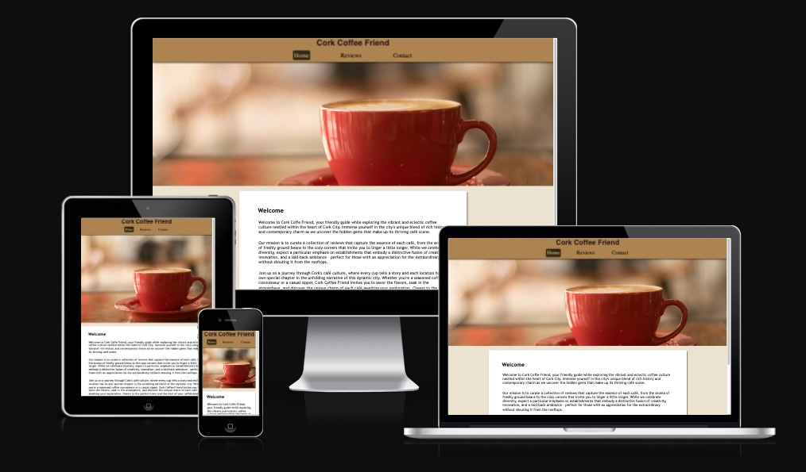
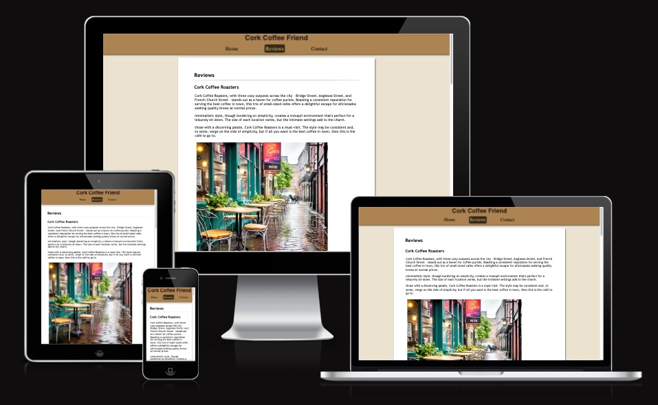
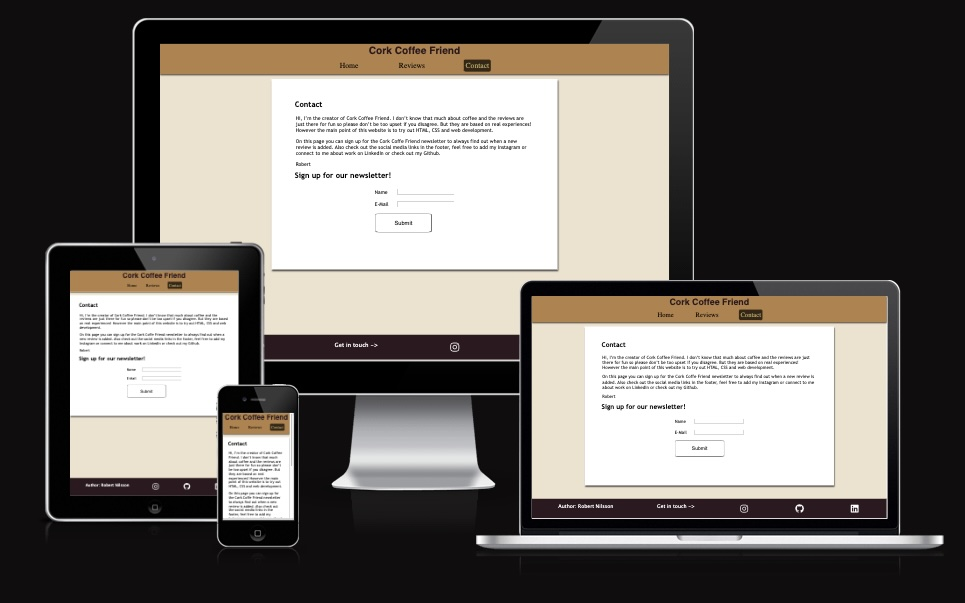
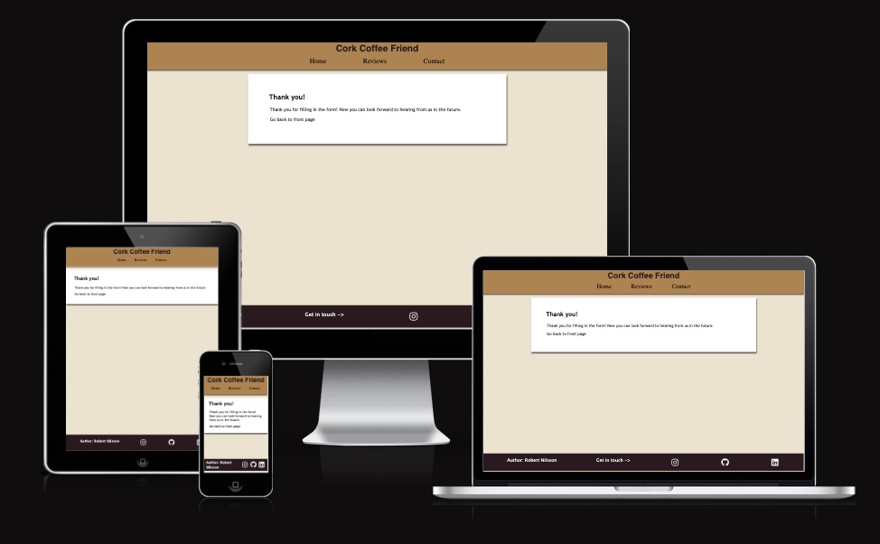

# Cork Coffe Friend - Testing

## CONTENTS

* [Automated Testing](#Automated-Testing)
  * [W3C Validator](#W3C-HTML-Validation)
  * [Lighthouse](#Lighthouse)
  * [Am I Responsive](#Am-I-Responsive)

* [Manual Testing](#manual-testing)
  * [Devices](#Devices)
  * [All manual tests](#Tests-Performed-Per-Page)

Testing was performed continously during development. A large amount of credit goes to Chrome developer tools and the function to adjust device dimensions to simulate different devices.
At the last stage of development Lighthouse (also in Chrome dev tools) was used to test site performance and fix a few things for SEO and accessibility, results from the Lighthouse test is included below.

## Automated Testing
### W3C HTML Validation

[W3C Validator](https://validator.w3.org/) was used to test all the HTML on the site

* index.html passed with no errors
* reviews.html passed with no errors
* contact.html passed with no errors
* thank-you.html passed with no errors

### W3C CSS Validation

[W3C CSS Validator \(Jigsaw\)] (https://jigsaw.w3.org/css-validator/) was used to test the CSS

* style.css passed with no errors

### Lighthouse

I used Lighthouse within the Chrome Developer Tools to test the performance, accessibility, best practices and SEO of the website. Scores 100 in all categories except performance which varied between 96 and 100, the slight dip in performance seems to be related to amount and size of image files as index.html and reviews.html are the ones that see a lower score and they are the pages with images which are somewhat large. Initially performance results was only 82 for reviews.html, but this score was improved after converting the images from jpg to webp format. The below table lists the most recent test on the current version of the site (February 6, 2024).

__Desktop Scores__
| Page | Performance | Accessibility | SEO | Best Practices |
|---|---|---|---|---|
|index.html|99|100|100|100|
|reviews.html|100|100|100|100|
|contact.html|100|100|100|100|
|thank-you.html|100|100|100|100|

__Mobile Scores__
| Page | Performance | Accessibility | SEO | Best Practices |
|---|---|---|---|---|
|index.html|97|100|100|100|
|reviews.html|96|100|100|100|
|contact.html|100|100|100|100|
|thank-you.html|99|100|100|100|

### Am I Responsive Results

Below are the results from [Am I Responsive](https://ui.dev/amiresponsive)

* index.html

* reviews.html

* contact.html

* thank-you.html

## MANUAL TESTING
### Devices

The site was fully tested with the following devices and browsers

* Macbook Pro 14-inch, 2023
    * Browser: Chrome, Safari
* Macbook Air 11-inch, Early-2015
    * Browser: Safari
* Desktop computer with 24-inch screen
  * Browser: Firefox
* iPhone 13
  * Browser: Safari
* iPhone 12 Mini
  * Browser: Safari

### Tests Performed Per Page

`Home - Cork Coffee Friend (index.html)`

| Feature | Expected Outcome | Testing Performed | Pass/Fail |
| --- | --- | --- | --- |
| The sites title | Link directs the user back to index.html (reloads current page) | Clicking or tapping | Pass |
| Navbar "Reviews" link | Redirects to the Reviews page | Clicking or tapping | Pass |
| Navbar "Contact" link | Redirects to the Contact page | Clicking or tapping | Pass |
| Go to reviews link | Redirects to the reviews page | Clicking or tapping | Pass |
| Instagram Icon in footer| Opens a new tab to site author's Instagram page | Clicking or tapping | Pass |
| Github Icon in footer| Opens a new tab to site author's Github page | Clicking or tapping | Pass |
| LinkedIn Icon in footer| Opens a new tab to site author's LinkedIn page | Clicking or tapping | Pass |
| All navbar links hover effect | All navbar links, except the one representing the currently active one, "Home", should receive a dark background and the black text should change to match the navbar background | Hover over each button in navbar | Pass |
| All footer social media icons hover effect | All footer links should invert colors, receive a white background and the icon should change from white to black for contrast | Hover over each social media icon in footer | Pass |

`Reviews - Cork Coffee Friend (reviews.html)`

| Feature | Expected Outcome | Testing Performed | Pass/Fail |
| --- | --- | --- | --- |
| The sites title | Link directs the user back to index.html | Clicking or tapping | Pass |
| Navbar "Home" link | Redirects to the Home page | Clicking or tapping | Pass |
| Navbar "Contact" link | Redirects to the Contact page | Clicking or tapping | Pass |
| Instagram Icon in footer| Opens a new tab to site author's Instagram page | Clicking or tapping | Pass |
| Github Icon in footer| Opens a new tab to site author's Github page | Clicking or tapping | Pass |
| LinkedIn Icon in footer| Opens a new tab to site author's LinkedIn page | Clicking or tapping | Pass |
| All navbar links hover effect | All navbar links, except the one representing the currently active one, "Reviews", should receive a dark background and the black text should change to match the navbar background | Hover over each button in navbar | Pass |
| All footer social media icons hover effect | All footer links should invert colors, receive a white background and the icon should change from white to black for contrast | Hover over each social media icon in footer | Pass |

`Contact - Cork Coffee Friend (contact.html)`

| Feature | Expected Outcome | Testing Performed | Pass/Fail |
| --- | --- | --- | --- |
| The sites title | Link directs the user back to index.html | Clicking or tapping | Pass |
| Navbar "Reviews" link | Redirects to the Reviews page | Clicking or tapping | Pass |
| Navbar "Home" link | Redirects to the Home page | Clicking or tapping | Pass |
| Form Submit with Name field empty | Shows an indication that the name field needs to be filled, regardless of if E-Mail field is filled in or not | Clicking or tapping | Pass |
| Form Submit with Name field filled in but email field empty | Shows an indication that the E-Mail field needs to be filled | Clicking or tapping | Pass |
| Form Submit with both Name and E-Mail fields filled in | Redirects to the thank-you.html page | Clicking or tapping | Pass |
| Instagram Icon in footer| Opens a new tab to site author's Instagram page | Clicking or tapping | Pass |
| Github Icon in footer| Opens a new tab to site author's Github page | Clicking or tapping | Pass |
| LinkedIn Icon in footer| Opens a new tab to site author's LinkedIn page | Clicking or tapping | Pass |
| All navbar links hover effect | All navbar links, except the one representing the currently active one, "Contact", should receive a dark background and the black text should change to match the navbar background | Hover over each button in navbar | Pass |
| All footer social media icons hover effect | All footer links should invert colors, receive a white background and the icon should change from white to black for contrast | Hover over each social media icon in footer | Pass |

`Thank You - Cork Coffee Friend (thank-you.html)`

| Feature | Expected Outcome | Testing Performed | Pass/Fail |
| --- | --- | --- | --- |
| The sites title | Link directs the user back to index.html | Clicking or tapping | Pass |
| Navbar "Home" link | Redirects to the Home page | Clicking or tapping | Pass |
| Navbar "Reviews" link | Redirects to the Reviews page | Clicking or tapping | Pass |
| Navbar "Contact" link | Redirects to the Contact page | Clicking or tapping | Pass |
| "Go back to front page" link inside main text | Redirects to the Home page | Clicking or tapping | Pass |
| Instagram Icon in footer| Opens a new tab to site author's Instagram page | Clicking or tapping | Pass |
| Github Icon in footer| Opens a new tab to site author's Github page | Clicking or tapping | Pass |
| LinkedIn Icon in footer| Opens a new tab to site author's LinkedIn page | Clicking or tapping | Pass |
| All navbar links hover effect | All navbar links should receive a dark background and the black text should change to match the navbar background | Hover over each button in navbar | Pass |
| All footer social media icons hover effect | All footer links should invert colors, receive a white background and the icon should change from white to black for contrast | Hover over each social media icon in footer | Pass |